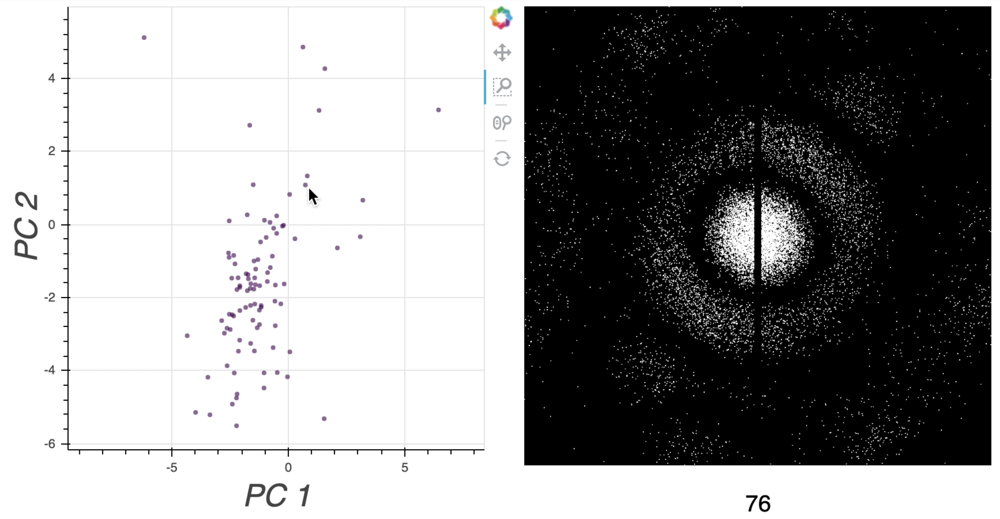

# LatentSpaceVisualizer

The Latent Space Visualizer is an interactive Python notebook that visualizes the latent space of an image dataset. The dataset contains a collection of latent variables that describes a set of labeled images. 

Two variables of the latent space are displayed in a 2D scatter plot. When the mouse is positioned near a point in the scatter plot, the image corresponding to that point is displayed to the side.



## Downloading the code

This command is used to download the code on your computer.

```bash
git clone https://github.com/compSPI/LatentSpaceVisualizer.git
```

## Installing the code on your computer

The following commands are used to install the code on your computer.

```bash
cd /path/to/LatentSpaceVisualizer
python setup.py install --user
```

## Installing the code on Jupyter Notebook

These commands are used to install the code on Jupyter Notebook.

```bash
cd /path/to/LatentSpaceVisualizer
conda env create compSPI/compSPI
conda activate compSPI
python -m ipykernel install --user --name compSPI --display-name "Python (compSPI)"
```

## Running the code in Jupyter Notebook

The following commands are used to run the code in Jupyter Notebook.

Start Jupyter Notebook.

```bash
jupyter notebook 
```

Open the tutorial notebook ```latent_space_visualizer.ipynb``` and change the Python kernel to ```compSPI```.

Find the following line in the notebook:

```python
dataset_file = '../data/cspi_synthetic_dataset_diffraction_patterns_1024x1040.hdf5'
```

Set the variable ```dataset_file``` to an HDF5 file containing the dataset.

Run the notebook.

## Building the Conda code package

The following command is used to build the Conda code package.

```bash
cd LatentSpaceVisualizer
conda build .
```

## Uploading the code package to the compSPI organization in Anaconda Cloud

In order to upload the built code package to the compSPI organization in Anaconda Cloud, you need to be added to the compSPI organization. After you have been added to the compSPI organization, follow the next set of instructions to upload the code package.

After you run the command to build the Conda code package, you should see a line that looks like:

(on Mac OSX)
```bash 
Processing '/Users/${USER}/opt/anaconda3/conda-bld/osx-64/latent-space-visualizer-0.0.1-py37_0.tar.bz2'
```

This location contains the built code package. To upload this code package  to the compSPI organization in Anaconda Cloud, run the following command.

```bash
anaconda upload --user compSPI '/Users/${USER}/opt/anaconda3/conda-bld/osx-64/latent-space-visualizer-0.0.1-py37_0.tar.bz2'
```

## Code structure

The relevant files and folders in this repository are described below:

- ```README.md```: Highlights the usefulness of the Latent Space Visualizer. 

- ```latent_space_visualizer.ipynb```:  Provides a tutorial notebook for using the Latent Space Visualizer.

- ```latent_space_visualizer/```: Contains the Python file required to run the notebook.
